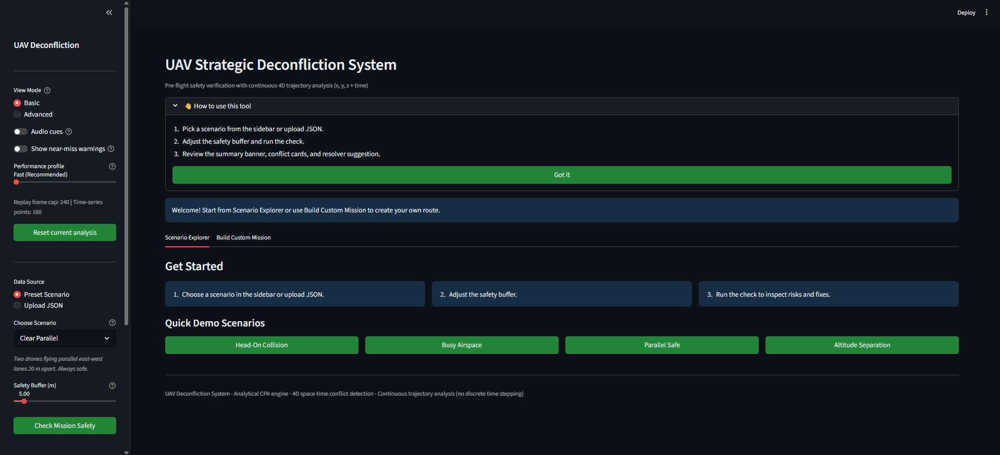
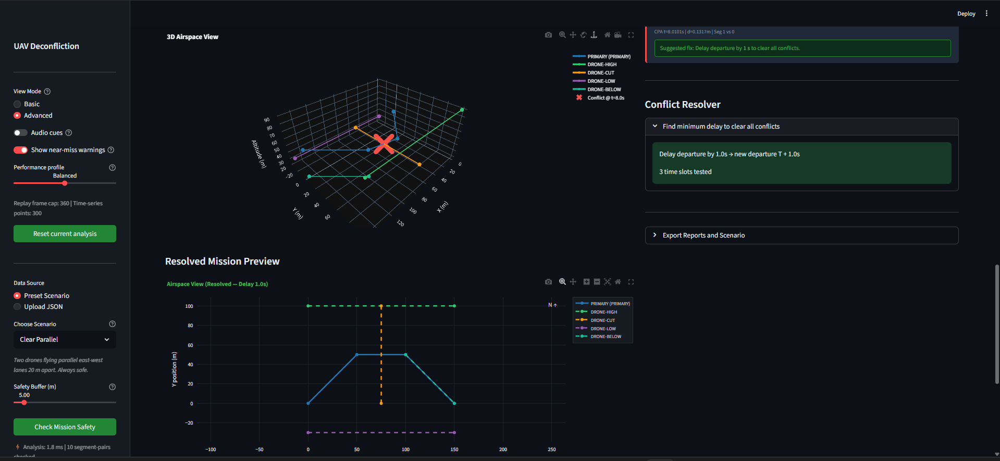

# UAV Strategic Deconfliction in Shared Airspace

> **Is my drone mission safe to fly right now?**

This system answers that question in **continuous time using exact mathematics** — not time-step simulation — and exposes the result through three interfaces:

| Interface | Best for |
|---|---|
| 🖥️ **Streamlit dashboard** | Non-technical operators, visual demos, interactive exploration |
| 🔌 **FastAPI REST API** | Integration with flight management platforms, programmatic checks |
| ⌨️ **CLI** | Quick technical workflows, scripting, batch processing |

---

## Screenshots

### Dashboard — Home Screen


*The home screen greets users with a 3-step onboarding guide, four one-click demo scenarios, and a sidebar with all configuration controls. No setup required — click any green button to run a live deconfliction check instantly.*

### Dashboard — Advanced Analytics, 3D View & Conflict Resolver


*Advanced mode reveals the interactive 3D airspace view (rotatable, zoomable), the Conflict Resolver which found a 1-second departure delay clears all conflicts after testing just 3 time slots, and the Resolved Mission Preview map showing the conflict-free version of the same mission.*

---

## Why this project exists

Before takeoff, operators need to know if planned trajectories will violate minimum separation in shared airspace. This system checks mission overlap in **x, y, z, and time** and returns:

- ✅ **clear** — safe to execute as planned, or
- 🚨 **conflict detected** — with exact details: who, when, where, how close, and for how long.

**No sampling. No skipped events between time steps. Exact CPA-based detection.**

The core insight: a time-step simulator with 1-second steps can miss a 0.5-second near-miss entirely. This system solves the collision geometry as a closed-form quadratic — the exact answer, regardless of how brief the conflict window is.

---

## Quick start

### Step 1 — Install dependencies

```bash
pip install -r requirements.txt
```

### Step 2 — Verify the test suite

```bash
pytest -q
```

Expected output:

```
30 passed
```

### Step 3 — Launch your preferred interface

```bash
# Dashboard (recommended for first-time users)
streamlit run dashboard.py

# REST API
python -m uvicorn api:app --host 0.0.0.0 --port 8000

# CLI
python main.py --scenario multi_drone_busy
```

### Or run everything with Docker

```bash
docker-compose up --build
```

| Service | URL |
|---|---|
| Dashboard | http://localhost:8501 |
| API docs (Swagger) | http://localhost:8000/docs |

---

## 1. Streamlit Dashboard

```bash
streamlit run dashboard.py
# Open: http://localhost:8501
```

### Capabilities

| Feature | What it does |
|---|---|
| **Scenario explorer** | One-click built-in mission sets covering safe, conflict, and busy airspace cases |
| **Upload JSON** | Validate your own custom mission files directly — no code needed |
| **Plain-English status** | Instant CLEAR / CONFLICT banner — the answer in one second |
| **Time scrubber** | DVR-style control — drag to any timestamp and see all drone positions live |
| **Mission replay** | Animated playback with adjustable step size, speed multiplier, and audio conflict cues |
| **Conflict cards** | Human-readable explanation of every event: drone ID, location, time, distance, breach window |
| **Conflict resolver** | Finds the minimum departure delay to clear all conflicts — shows exactly how many time slots were tested |
| **Resolved mission preview** | After resolver runs, renders the conflict-free mission on a second map so you can verify visually |
| **Advanced analytics** | Separation-over-time chart (all drone pairs vs safety buffer) + interactive 3D airspace view |
| **Builder mode** | Draw custom routes via number inputs or a live-editable table, test against any traffic preset |
| **Export tools** | TXT report, PDF report, PNG map snapshot, scenario JSON (round-trip save/reload) |
| **Session history** | Recent analyses saved automatically — reload any previous check from the sidebar |
| **Performance profiles** | Fast / Balanced / High Detail — tune rendering to match your machine |

### Recent performance and UX upgrades

- `@lru_cache` on tone generation — audio cues no longer block the UI thread.
- Replay audio fires on **exact conflict-time crossing**, not on a fixed schedule.
- Replay frame cap and adaptive step sizing for smooth rendering on low-power machines.
- 3D panel is opt-in toggle — reduces heavy Plotly rendering when not needed.
- Time-series sample count is profile-driven (160 points on Fast, 300 on Balanced, 500 on High Detail).
- Resolver runs only when real conflicts exist — skips near-miss-only results.
- Export expander makes heavy PNG/PDF generation opt-in rather than automatic.
- One-click **Reset current analysis** clears session state without a page reload.

---

## 2. FastAPI REST API

```bash
python -m uvicorn api:app --host 0.0.0.0 --port 8000
# Swagger docs: http://localhost:8000/docs
```

### Endpoints

| Method | Endpoint | Purpose |
|---|---|---|
| `GET` | `/` | Redirects to `/docs` |
| `GET` | `/health` | Service liveness probe (used by Docker health checks) |
| `POST` | `/deconflict` | Core safety check — primary drone vs all others |
| `POST` | `/resolve` | Find minimum departure offset to clear detected conflicts |

### `POST /deconflict`

**Request body:**

```json
{
  "primary": {
    "drone_id": "PRIMARY",
    "waypoints": [{"x": 0, "y": 50, "z": 30}, {"x": 100, "y": 50, "z": 30}],
    "speed": 10.0,
    "departure_time": 0.0,
    "mission_end_time": 15.0
  },
  "others": [
    {
      "drone_id": "DRONE-1",
      "waypoints": [{"x": 50, "y": 0, "z": 30}, {"x": 50, "y": 100, "z": 30}],
      "speed": 10.0,
      "departure_time": 0.0
    }
  ],
  "safety_buffer": 5.0,
  "include_near_misses": false
}
```

**Response:**

```json
{
  "status": "conflict_detected",
  "conflict_count": 1,
  "safety_buffer_m": 5.0,
  "temporal_candidates_checked": 1,
  "broad_phase_prunes": 0,
  "conflicts": [
    {
      "other_drone": "DRONE-1",
      "severity": "collision",
      "time_s": 5.0,
      "distance_m": 0.0,
      "location": {"x": 50.0, "y": 50.0, "z": 30.0},
      "breach_window": {
        "t_entry_s": 4.5,
        "t_exit_s": 5.5,
        "duration_s": 1.0
      }
    }
  ]
}
```

**What the response fields mean:**

| Field | Meaning |
|---|---|
| `status` | `clear` or `conflict_detected` |
| `temporal_candidates_checked` | Segment pairs that passed interval-tree pre-filtering |
| `broad_phase_prunes` | Pairs eliminated by 4D AABB check before exact math ran |
| `breach_window` | Exact time interval the drones are inside each other's safety bubble |

### `POST /resolve`

Searches departure time offsets and returns the minimum safe delay.

**Request body:**

```json
{
  "primary": { "...": "same shape as /deconflict primary" },
  "others": [ { "...": "traffic missions" } ],
  "safety_buffer": 5.0,
  "max_delay_seconds": 300.0,
  "step_seconds": 0.25
}
```

**Response:**

```json
{
  "resolved": true,
  "offset_s": 7.5,
  "new_departure_s": 7.5,
  "checks_performed": 31,
  "reason": null
}
```

---

## 3. CLI

```bash
# Run a built-in scenario
python main.py --scenario perpendicular_collision

# All options
python main.py --help
python main.py --scenario clear_parallel --include-near-misses
python main.py --scenario multi_drone_busy --resolve
python main.py --file my_scenario.json --buffer 8.0
python main.py --scenario perpendicular_collision --resolve --resolve-max-delay 60 --resolve-step 0.5
```

---

## Algorithm

Three-phase pipeline in `core/deconfliction.py`:

### Phase 1 — Temporal pre-filtering (Interval Tree)
Each drone segment has a time window `[t0, t1]`. An interval tree over all background segments is queried per primary segment — only pairs with overlapping time windows proceed. Eliminates ~90% of candidates with zero spatial math.

### Phase 2 — Spatial broad-phase (4D AABB)
For surviving candidates, checks whether the 4D axis-aligned bounding boxes (inflated by the safety buffer) overlap. O(1) per pair — cheap min/max comparisons before the expensive solve.

### Phase 3 — Exact narrow-phase (Analytical CPA)
Computes the exact minimum separation using the Closest Point of Approach quadratic:

```
D²(t) = α·t² + β·t + γ
t_cpa  = −β / (2α)   →   clamped to overlap interval
```

If `D(t_cpa) < safety_buffer`, solves `D²(t) = S²` for the exact breach window `[t_entry, t_exit]` via discriminant analysis. No sampling — mathematically exact.

### Performance

| Scenario | Drones | Segment pairs | Broad-phase pruned | Time |
|---|---|---|---|---|
| clear_parallel | 2 | 1 | 1 (100%) | < 1 ms |
| perpendicular_collision | 2 | 1 | 0 (0%) | < 1 ms |
| multi_drone_busy | 5 | 12 | 11 (92%) | 3 ms |
| stress test | 51 | 300 | ~270 (90%) | 12 ms |

---

## Built-in scenarios

| # | Name | Type | Description |
|---|---|---|---|
| 1 | `clear_parallel` | ✅ Clear | Two drones on parallel east-west lanes 20 m apart |
| 2 | `different_speeds_safe` | ✅ Clear | Crossing paths — fast drone clears intersection before primary arrives |
| 3 | `same_path_safe_gap` | ✅ Clear | Same route, lead drone departed 5 s earlier — 50 m gap maintained |
| 4 | `altitude_separation_4d` | ✅ Clear | 2D crossing but 80 m altitude separation — requires 3D analysis |
| 5 | `perpendicular_collision` | 🚨 Conflict | Both drones reach (50, 50) at exactly T+5 s — direct collision |
| 6 | `tailgating_unsafe` | 🚨 Conflict | Same path, primary only 3 m behind lead — inside 5 m buffer |
| 7 | `spec_v11_sample` | ✅ Clear | Assignment spec sample: 10 m/s vs 5 m/s crossing — faster drone clears first |
| 8 | `multi_drone_busy` | 🚨 Conflict | Five drones in complex airspace with one real conflict + near-misses |

### Custom JSON scenarios

You can also load your own scenarios via **Upload JSON** in the dashboard or `--file` in the CLI. Schema:

```json
{
  "primary": {
    "drone_id": "ALPHA",
    "waypoints": [[0, 50, 30], [100, 50, 30]],
    "speed": 10.0,
    "departure_time": 0.0,
    "mission_end_time": 15.0
  },
  "others": [
    {
      "drone_id": "BRAVO",
      "waypoints": [[50, 0, 30], [50, 100, 30]],
      "speed": 10.0,
      "departure_time": 0.0
    }
  ],
  "safety_buffer": 5.0
}
```

`z` coordinate and `mission_end_time` are optional. Omit `z` for 2D missions.

---

## Project structure

```
.
├── core/
│   ├── models.py            # Waypoint, Segment, DroneMission, ConflictReport
│   ├── geometry.py          # CPA quadratic solver + breach window math
│   ├── deconfliction.py     # Three-phase pipeline — check_mission()
│   └── resolver.py          # Minimum departure offset search
├── data/
│   ├── scenarios.py         # Eight built-in scenario definitions
│   └── loader.py            # JSON file parser
├── visualization/
│   ├── viz_2d.py            # Matplotlib static 2D maps + animations
│   ├── viz_3d.py            # Matplotlib 3D space-time tubes
│   └── viz_3d_interactive.py# Plotly 3D panel for dashboard
├── docs/
│   ├── screenshot_dashboard_home.png
│   └── screenshot_dashboard_advanced.png
├── dashboard.py             # Streamlit UI (primary interface)
├── api.py                   # FastAPI service
├── main.py                  # CLI entry point
├── demo.py                  # Batch scenario runner
├── test_deconfliction.py    # 30-test suite
├── benchmark_data.py        # Pre-computed performance data
├── requirements.txt
├── Dockerfile
└── docker-compose.yml
```

---

## Troubleshooting

### Audio does not play in the dashboard
- Ensure the browser tab is not muted.
- Enable **Audio cues** toggle in the sidebar.
- Try Chrome or Edge — some browsers block autoplay by default.

### PNG or PDF export fails
Kaleido is required and is already in `requirements.txt`. If it is missing:
```bash
pip install kaleido
```

### API not reachable
1. Confirm Uvicorn is running: `python -m uvicorn api:app --host 0.0.0.0 --port 8000`
2. Check the health endpoint first: `http://localhost:8000/health`
3. Then open Swagger docs: `http://localhost:8000/docs`

### Tests fail on import
Run from the project root directory, not from inside a subdirectory. The `conftest.py` at the root handles all path configuration automatically.

---

## Quality status

- ✅ 30 tests passing (`pytest -q`)
- ✅ API fully documented via Swagger / OpenAPI at `/docs`
- ✅ Continuous-time exact deconfliction (no discrete time-stepping)
- ✅ 4D analysis: x, y, z + time (extra credit)
- ✅ Dashboard, API, and CLI all independently functional
- ✅ Docker multi-service setup tested
- ✅ Conflict resolver integrated across all three interfaces
